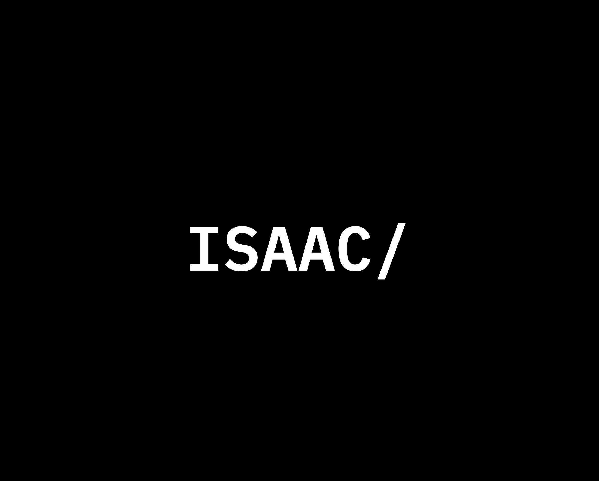

# [Personal Website](https://personal.isaacdev.net)

A personal website that demonstrate projects I have worked on.

Using a low-cost and serverless solution in AWS to deliver the website.

## Architecture

## Repositories

[Pulumi Repo](https://github.com/IsaacOrzDev/personal-website-pulumi-stack)

Steup the infrastructure includes lambda functions and cloudfront by using Pulumi.

[CDK Repo (Deprecated)](https://github.com/IsaacOrzDev/personal-website-aws-cdk)

I currently use Pulumi instead of CDK to setup the infrastructure to avoid using CloudFormation.

[Frontend Repo](https://github.com/IsaacOrzDev/personal-website-frontend)

A frontend project do not use UI libraries but only use React and Vite.

[Frontend Extensions Repo](https://github.com/IsaacOrzDev/personal-website-extenions)

Some extensions for the website, such as gallery page.
